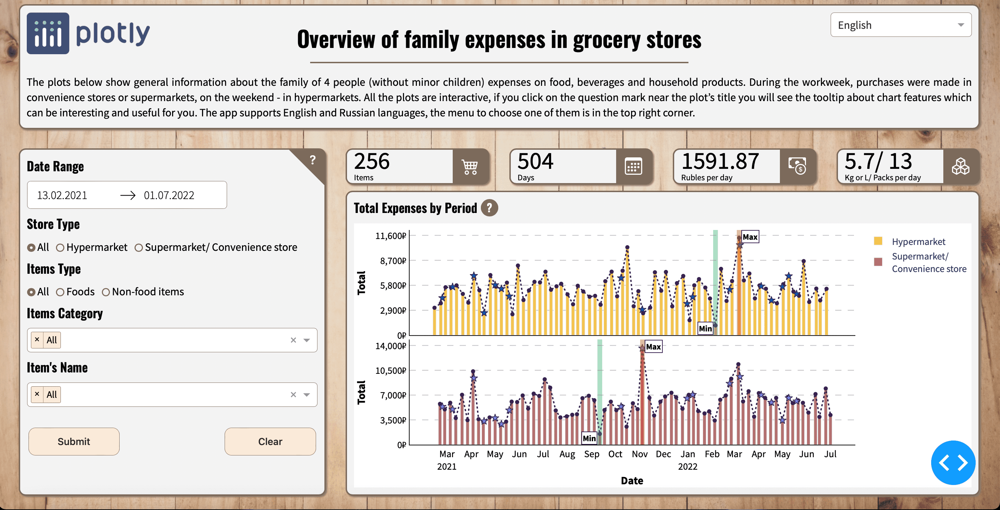

# Overview of family expenses in grocery stores

## About the app
This app displays expenses of the family of 4 people (without minor children) on food, beverages and household items. During the workweek, purchases were made in convenience stores or supermarkets, on the weekend - in hypermarkets. The data for days between two nearby purchases in a hypermarket is in a form of one value for all the period and corresponds to the end of this time interval. For example, buyings in hypermarkets were made at 26th of February, 2022 and at 7th of March, 2022 so the data about purchases between these days is united in one value that corresponds to the 6th of March, 2022.

There are filters at the top left side of the app for selecting a date range, type of a store, type of products (food, non-food items or all), certain categories or items names. Please, be sure to choose at least one item (or click on the "All" option) and check that the entered time interval is correct. If you make mistakes at these points, the app will not be «broken», it will just show you the error message and not update the data on the page.

Click on the "?" symbol near the object (e.g. the menu, a plot) to learn more about interaction with it. Click on it again to hide the help.

The app supports English and Russian languages, the menu to choose one of them is in the top right corner.

The app was created using [Dash](https://dash.plotly.com) (main user interface) and [Plotly](https://plotly.com/python/) (interactive plots).
